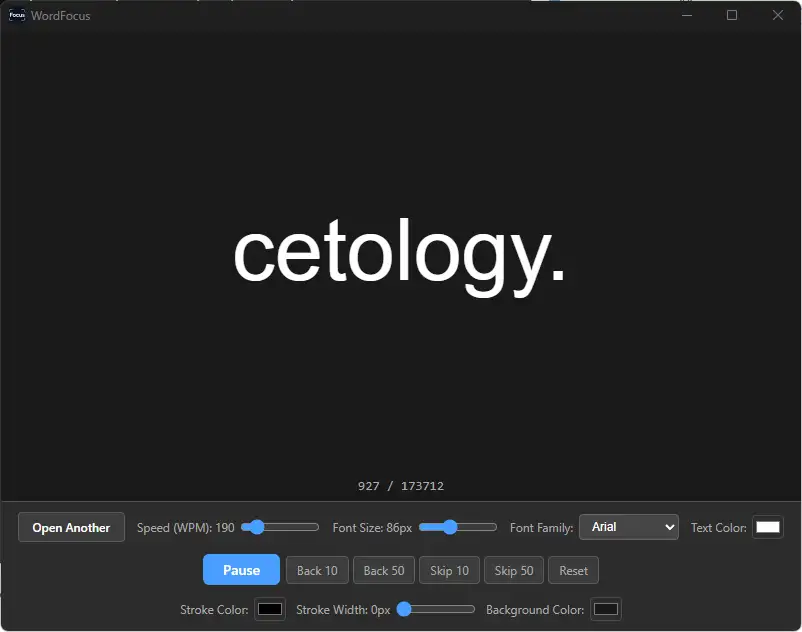

# WordFocus

[](https://github.com/Ultikynnys/WordFocus/actions/workflows/build.yml)


WordFocus is a desktop speed-reading app built with Tauri, React, TypeScript, and Rust.

The idea came from a Reddit video where someone claimed you can read faster if you only focus on a single word at a time. This project exists to test that theory in a simple, repeatable way. I am actively using it to see whether those claims actually hold up in practice.

## Preview



## What It Does

WordFocus opens text-based documents and displays the content one token at a time in a large, centered reading area. Instead of scanning lines or paragraphs, you keep your attention on a single word on screen while the app advances automatically.

The app currently supports:

- `.txt`
- `.md`
- `.epub`
- `.epub3`
- `.pdf` with embedded/OCR-readable text

## Features

- Single-word reading interface
- Adjustable words per minute
- Per-word timing scaled by token length from `1x` to `3x`
- Single-line word display with dynamic font scaling
- Font family selector, including embedded `OpenDyslexic`
- Adjustable font size, text color, background color, stroke color, and stroke width
- Back 10 / Back 50 navigation
- Skip 10 / Skip 50 navigation
- Seek directly to a specific word number
- Reset to the beginning
- EPUB and PDF text extraction in the desktop backend
- Per-file reading progress saved in local temporary storage for later resume
- Cross-platform desktop build output for Windows, Linux, and macOS
- Optional debug console logging when launched with `-d` or `-debug`
- Manually triggered GitHub Actions build verification across Windows, Linux, and macOS

## Why This Exists

WordFocus is an experiment, not a claim of scientific proof. The goal is to build a usable tool for testing whether isolating one word at a time can improve reading speed, comprehension, or focus.

## Tech Stack

- Frontend: React + TypeScript + Vite
- Desktop runtime: Tauri v2
- Backend: Rust
- Package manager: Bun

## Development

Install dependencies:

```sh
bun install
```

Run the frontend in development:

```sh
bun run dev
```

Run type checking:

```sh
bun run check
```

Run the Tauri app in development:

```sh
bun tauri dev
```

## Build Steps

Build the frontend only:

```sh
bun run build
```

Build the standalone release artifact for the current OS:

```sh
bun run build:release
```

This produces:

```text
Windows: src-tauri/target/release/word-focus.exe
Linux:   src-tauri/target/release/word-focus
macOS:   src-tauri/target/release/word-focus
```

On Windows, the release app runs without a console by default. Launch it with `-d` or `-debug` to attach a debug console for frontend/backend error output.

## License

This project is licensed under the MIT License and copyright belongs to Ubeid Hussein.

You are free to use, modify, and distribute it as long as the license text is preserved.
